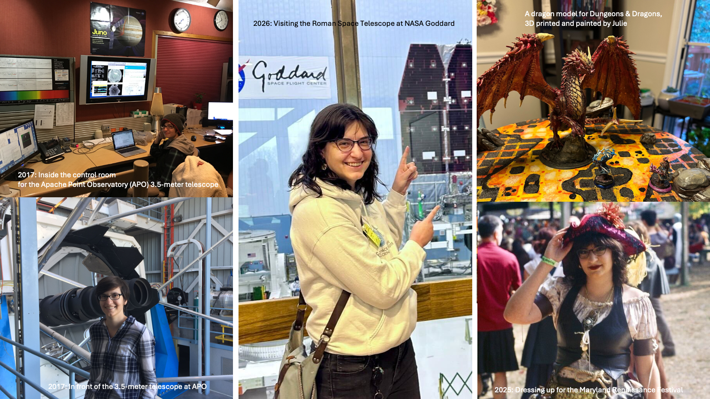

# A Series: *"Meet MAST"*

> I remember how little I knew about MAST when I was preparing for my job interview. STScI is a highly respected institution, and MAST's mission of making data from more than twenty space missions available to everyone was inspiring. The opportunity to work at such a renowned place was incredibly attractive.
>
> At the same time, I had never used MAST data in my own research, and I did not know much about space telescopes. MAST felt like a black box to me. I tried to imagine what people at MAST actually did and how everything worked behind the scenes.
>
> We are naturally curious about things that work exceptionally well and often wonder what makes them successful. MAST users, particularly newer users, may have similar questions. What makes MAST "MAST"? Who are the people behind the archive? What do they do day to day?
>

To answer those questions, we are launching the *Meet MAST Series*, a new interview series that introduces the astronomers, engineers, writers, designers, and other staff members behind MAST's services, tools, and data products.

As part of *Meet MAST*, you'll learn about the people who make MAST possible, their career paths, their day-to-day work, and the projects they are most passionate about.

Our first interview is with Julie Imig, Senior Astronomical Data Scientist.

# Meet Julie Imig

*"What? Julie! You made all of these?"*

That was my reaction the first time I visited Julie Imig's apartment for a Dungeons & Dragons game she was hosting.

As soon as I walked in, I noticed her collection of 3D-printed creations. There were dragons, fantasy buildings, trains, D&D props, customs, and even a model of Howl's Moving Castle. Everything was designed, printed, painted, and assembled by Julie. I was amazed that one person could create so many detailed pieces as a hobby.

That visit left a lasting impression on me. Julie has a unique combination of technical skills and creativity. Once you see her work, it becomes easy to understand why.

I have been fortunate to work with many talented, hardworking, generous, and approachable people at MAST, and Julie is one of them. As a Senior Astronomical Data Scientist in the Catalog Science Branch, she has contributed to many important projects, including archiving [SDSS Legacy data](https://archive.stsci.edu/missions-and-data/sdss) and [High-Level Science Products](https://mast.stsci.edu/hlsp/#/), as well as applications and databases that support the MAST search services used by astronomers around the world.

Years later, whenever I use visualizations such as [MAST's View of the Sky](https://spacetelescope.github.io/mast-blog/mast-heatmap.html) or the [Jupyter notebook of MAST sky footprints](https://spacetelescope.github.io/mast_notebooks/notebooks/Visualizations/mast_sky/mast_sky.html) and other resources she has helped create, I am reminded of that first visit. The same attention to detail that I saw in her hobby projects is reflected in her work for the astronomical community.

In this interview, Julie shares her path into astronomy, her work at MAST, the projects she is most proud of, and some of the creative hobbies that keep her inspired outside of work.

#### Share key parts of your schooling/career that enabled you to join MAST

My career path has been fairly typical for an astronomer: I have an undergraduate degree in Physics from the University of Utah and a PhD in Astronomy from New Mexico State University.

Several years before I joined MAST, I was actually an undergraduate summer intern at STScI! My internship project was to create a Twitter bot which live-tweeted what HST was observing at any given moment: that project is now "Space Telescope Live" (https://spacetelescopelive.org)! I cannot take any credit for the current amazing version of Space Telescope Live - my contribution was just the small Twitter bot, and Twitter doesn't even exist anymore! But the internship was an amazing experience, and a big reason why I wanted to come back to the Institute after completing my PhD.

Another key experience for me was in graduate school, I led the data reductions and quality control for the SDSS APOGEE Survey for several years. Every single night as fresh data came off the telescope, I had the responsibility of inspecting it to make sure that everything was successful and the data was high-quality. I have looked at literally MILLIONS of spectra over the several years that I did this - and that very much prepared me for working with the large volume of data we process at MAST! 

#### What brought you to MAST?

I joined the MAST team in 2023, and I was drawn to the archive because I believe in the mission. We archive data from dozens of different telescopes, dating back to 1978. Making sure that data is available and easily accessible is so important - there are still so many scientific discoveries to be made, even with "old" data. MAST enables scientific discovery through its data accessibility, which is something that I am very passionate about.

#### What does a typical day at MAST look like for you? What is your favorite project you have worked on at MAST? Are there any tasks that put you in a state of "flow"?

My typical day is a combination of meetings, coding, and research! One of the fun things about working at MAST is the variety of different projects we're involved in. One minute I'll be helping publish brand new JWST data of exoplanets, and the next I might be copying SDSS data from the 1990s, or updating some software in preparation for Roman. Then in the afternoon I'll be working on my own research projects uncovering the mysteries of the Milky Way. Everyone here is so passionate about what we do, and there are so many cool projects, it can be difficult to not want to be involved in everything!

#### Share your personal favorite MAST service?

It may be a little outdated, but I absolutely love the MAST Portal (https://mast.stsci.edu/)! It's an incredibly powerful tool for searching through the hundreds of millions of observations in the archive. The advanced search capabilities make discovering new data so easy - for example, finding a light curve to complement a spectrum I have of a particular star, or even for answering silly questions like "What was HST looking at on the day I was born?" (For me, it was the planetary nebula NGC-2022!)

On a personal note, I'm also very proud of the SDSS Legacy Archive at MAST (https://archive.stsci.edu/sdss), which I helped create! I have spent many years of my professional career working with data from SDSS, which covers almost everything an astronomer could ask for - galaxies, stars, spectra, imaging, optical, infrared, you name it. Now that data is available at MAST, right next to HST, JWST, and TESS, enabling the kind of cross-mission science that makes me so excited. 

#### What is your workspace like? Do you work from home, or the office? Desk or couch?

You can find me around the office 3-4 days a week, and working from home the rest of the time! I appreciate having the flexibility. My office space is decorated with a variety of astronomy-related things: an aluminum plug plate from SDSS, different posters of HST/JWST images, and several NASA Lego sets! "The Milky Way Galaxy" and the "Women of NASA" Lego sets are two of my favorites.

#### What do you do outside work for fun?

I have a lot of hobbies which can loosely be described as "making stuff" - I enjoy painting, sewing, sculpting, 3D printing, and challenging myself to learn new artistic skills all the time. I love all things fantasy, such as playing Dungeons and Dragons or going to Renaissance Festivals with my friends, and that drives a lot of my creative projects!

#### What most excites you about the future?

I am beyond excited for the launch of the Roman Space Telescope this year!! In my research field, there are a lot of open questions about the history of the Milky Way, and how we compare to other galaxies in the Universe. Roman's infrared eyesight, high resolution, and large-scale surveys are going to help directly answer those questions and lead to so many new discoveries. I can't wait.

#### If you were a space telescope, which one would you be?

If I were a space telescope, I think I would be Gaia! Gaia was launched in 2013, which was the same year that I started pursuing my astronomy career in college. And just like Gaia, I have spent the last 13 years mapping the Milky Way using a very large sample of stars! 

Author: Jinmi Yoon
Editor:
